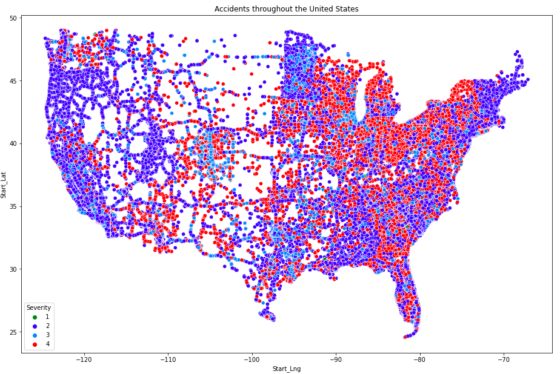
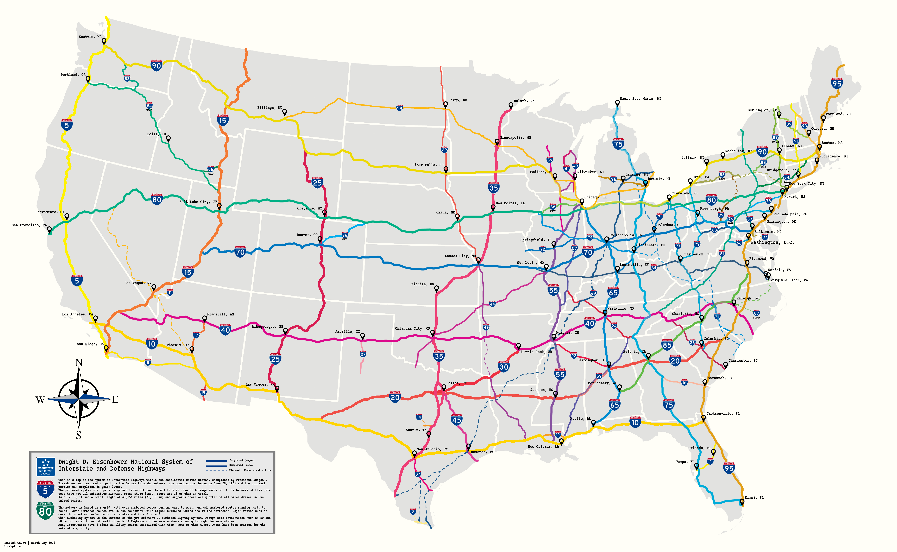
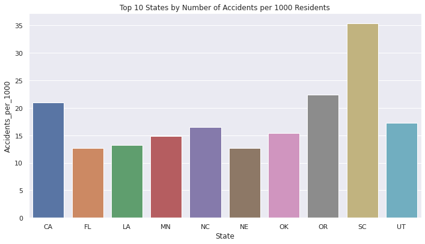
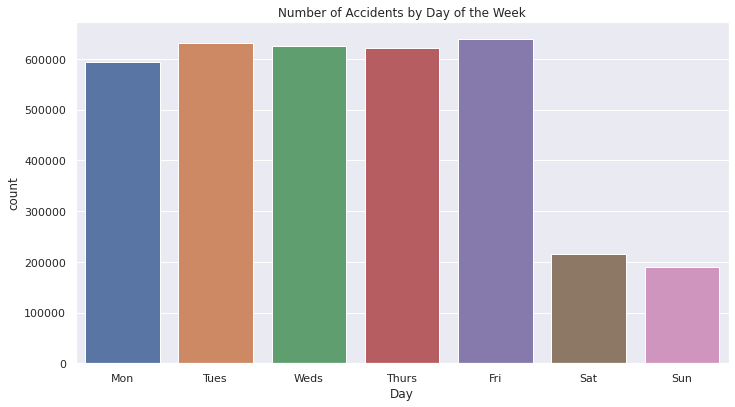
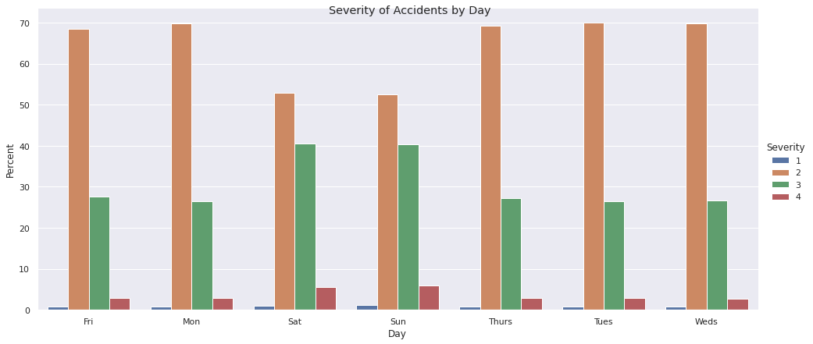
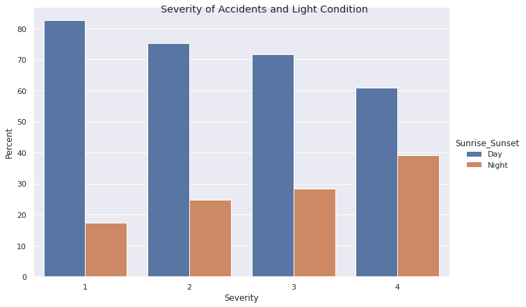

-   [Introduction](#introduction)
-   [Data Organization](#data-organization)
    -   [US Accidents Data](##us-accidents-data)
    -   [US Census Demographic Data](##us-census-demographic-data)
-   [Exploratory Data Analysis](#exploratory-data-analysis)
    -   [Accidents Map](##accidents-map)
    -   [Top 10 States by Number of Accidents](##top-10-states-by-number-of-accidents)
    -   [Accident Rate by Day of the Week](##accident-rate-by-day-of-the-week)
    -   [Accident Severity by Time of the Day](##accident-severity-by-time-of-the-day)
-   [Conclusions](#conclusions)
    -   [Main Observations](##main-observations)
    -   [Future Directions](##future-directions)
-   [Run Notebook in Google Colab](#run-notebook-in-google-colab)
-   [Inquiries](#inquiries)
-   [Data Sources](#licensing)
-   [Acknowledgments](#references)

# Introduction
Motor vehicle accidents is a leading cause of death and injury in the United States. The use of motor vehicles is steadily increasing in the United States, with the number of vehicle miles traveled increasing each year. As more and more Americans place their lives and wellbeing in the hands of traffic and motor vehicles, ensuring their safety becomes an issue of the utmost importance. In 2015 over 2.5 million individuals were treated in emergency departments for injuries resulting from motor vehicle crashes (CDC, 2020). In 2019 alone, the National Highway Traffic Safety Administration reported over 36,096 fatalities in motor vehicle accidents (NHTSA, 2020). In addition to posing a danger to the safety of the people, motor vehicle accidents are currently a financial drain on the United States government and economy. The CDC estimates that for crashes that occurred in 2017, the cost of medical care and productivity losses associated with occupant injuries and deaths from motor vehicle traffic crashes exceeded $75 billion (CDC, 2020). Furthermore, traffic safety has been the target of a significant amount of spending by the government and other organizations.

With this in mind, we have decided to analyze data related to accidents in the United States with the goal of uncovering potential patterns in the occurrences of accidents. The specific questions we are looking to investigate are: **What conditions may make the risk of accidents higher?** and **What conditions impact the severity of accidents that occur?**

This analysis has the potential to provide valuable insight for people and organizations who are working to decrease the risk of accidents in the United States. An understanding of factors that increase the risk and severity of motor vehicle accidents would allow these organizations to carry out targeted efforts to ameliorate those conditions. Such efforts not only have the potential to save lives, but also save money and allow for optimal use of funds.

# Data Organization
In order to obtain insight on our question of causes of motor vehicle accidents in the United States, we used two main datasets. The first dataset, [US-Accidents](https://www.kaggle.com/sobhanmoosavi/us-accidents), provides about 3.5 million instances of traffic accidents that have taken place across the contiguous United States between February 2016 and June 2020. The second dataset, [US Census Demographic Data](https://www.kaggle.com/muonneutrino/us-census-demographic-data), contains information regarding the population of each state and county in the United States in 2015 and 2017. For the purposes of this analysis, we use the county data collected in 2017 as it is the more recent of the two. Although the accidents we are looking at happened over the span of five years (2016-2020), we do think that the 2017 population data is a decent representation for all of our analysis since we think that the population would not have changed by a significant amount. The latter dataset will be used to standardize the analysis of the occurrence of accidents across different sized states.

After filtering the data by removing the irrelevant attributes to our analysis, we ended up with the following attributes:

## US Accidents Data:

| Attribute | Data Type | Description | Nullable |
| --- | --- | --- | --- |
| Severity | Ordinal | Shows severity of the accident on a scale of 1-4 (1 indicates the least impact on traffic and 4 indicates a significant impact on traffic | No |
| Start_Lat | Categorical | Shows latitude in GPS coordinate of the start point | No |
| Start_Lng | Categorical | Shows longitude in GPS coordinate of the start point | No |
| Distance(mi) | Ratio | The length of the road extent affected by the accident | No |
| County | Categorical | Shows the county in address field | Yes |
| State | Categorical | Shows the state in address field | Yes |
| Temperature(F) | Categorical | Shows the time-stamp of weather observation record in local time | Yes |
| Humidity(%) | Categorical | Shows the humidity in percentage | Yes |
| Pressure(in) | Categorical | Shows air pressure in inches | Yes |
| Visibility(mi) | Categorical | Shows visibility in miles  | Yes |
| Wind_Speed| Categorical | Shows wind speed in miles per hour | Yes |
| Precipitation(in) | Categorical | Shows precipitation amount in inches | Yes |
| Amenity | Categorical | A POI annotation which indicates presence of amenity in a nearby location | No |
| Bump | Categorical | A POI annotation which indicates presence of speed bump or hump in a nearby location | No |
| Crossing | Categorical | A POI annotation which indicates presence of crossing  in a nearby location | No |
| Give_Way | Categorical | A POI annotation which indicates presence of giveway sign in a nearby location | No |
| Junction | Categorical | A POI annotation which indicates presence of junction in a nearby location | No |
| No_Exit | Categorical | A POI annotation which indicates presence of no exit sign in a nearby location | No |
| Railway | Categorical | A POI annotation which indicates presence of railway in a nearby location | No |
| Roundabout | Categorical | A POI annotation which indicates presence of roundabout in a nearby location | No |
| Station | Categorical | A POI annotation which indicates presence of station (bus, train, etc.) in a nearby location | No |
| Stop | Categorical | A POI annotation which indicates presence of stop sign in a nearby location | No |
| Traffic_Calming | Categorical | A POI annotation which indicates presence of traffic calming means in a nearby location | No |
| Traffic_Signal | Categorical | A POI annotation which indicates presence of traffic signal in a nearby location | No |
| Turning_Loop | Categorical | A POI annotation which indicates presence of turning loop in a nearby location | No |
| Sunrise_Sunset | Categorical | Shows the period of day (i.e. day or night) based on sunrise/sunset | Yes |

## US Census Demographic Data:

| Attribute | Data Type | Description | Nullable |
| --- | --- | --- | --- |
| State | Categorical | Name of one of the 52 states of America, or DC or Puerto Rico | No |
| County | Categorical | Name of the county or county equivalent | No |
| TotalPopulation | Ratio | Total population of the county | No |
| Drive | Ratio | Percentage of the county’s population commuting alone in a car, van, or truck | No |
| Transit | Ratio | Percentage of the county’s population commuting on public transport | No |
| MeanCommute | Ratio | Mean commute time in minutes | No |
| Poverty | Ratio | Percentage of the county’s population under the level of poverty | No |

Furthermore, we added the following attributes that we use later in our analysis:

| Attribute | Data Type | Description | Nullable |
| --- | --- | --- | --- |
| Duration | Ratio | The time duration of the accident in minutes which is calculated as the difference between the start time and end time | No |
| Start_Hour | Ratio | The hour when the accident started | No |
| Day | Categorical | The day of the week on which the accident took place | No |

For more details about the datasets and a full list of attributes, please refer to [our notebook](https://github.com/pard187/pard187.github.io/blob/master/Final_Project_Gormley_Giffin_Johnston_Saleh.ipynb).

# Exploratory Data Analysis
Here we explore some of the most interesting trends in our data. Please refer to [our notebook](https://github.com/pard187/pard187.github.io/blob/master/Final_Project_Gormley_Giffin_Johnston_Saleh.ipynb) to explore more profound Data Analysis findings and relatively successful Machine Learning models.

## Accidents Map
The following plot displays a scatterplot of accidents in the United States based on Latitude and Longitude. Note that the points are colored by Severity of the accident with red corresponding the Level 4 Severity (the most severe). Below the plot is a map of the major highways and interstates in the United States.
From these plots, we make a few observations. First, we observe that the accidents, and the Level 4 accidents in particular, seem to follow along the paths of the major highways and interstates in the United States. We have inserted a figure below to illustrate this point. Second, we observe the highest concentration of Level 4 accidents in the most densely populated areas near large cities such as Chicago, Portland, Colombus, and Jacksonville. The Southeast and Midwest regions show particularly high concentrations of severe accidents.

## Top 10 States by Number of Accidents
After standardizing our data based on the population size, we were able to generate this plot which shows the number of accidents per 1000 residents for the top 10 states.
|::|

## Accident Rate and Severity by Day of the Week
The following two plots explore the relationship between accidents and days of the week. The first plot compares the number of accidents happening on each day of the week. We note that the number of accidents is fairly consistent Monday-Friday, however, the number of accidents drops significantly, to about a third of the original number, on the weekends. We hypothesize that this could be due to the work commute which happens Monday-Friday, but not on Saturday or Sunday. This is reasonable but something interesting shows up in the second graph, which compares the accident severity on each day of the week. It is noticeable that while there are fewer accidents occuring on the weekends, the severity of the accidents increases. During the weekdays, the percentage of accidents classified as Level 4 is constantly at under 5% of the total number of accidents. However, on Saturday and Sunday, this percentage nearly doubles.

## Accident Severity by Time of the Day
This plot aims to compare the severity of accidents happening in the daytime versus those happening at night. We note that as the severity of the motor vehicle accident increases, the percentage of accidents that occur after sunset increases from less than 20% (Severity Level 1) to nearly 40% (Severity Level 4). We hypothesize that this difference could be due to driving conditions, specifically the lack of light during those hours of the day, as the sun has completely set. This could also be due to human conditions such as fatigue, or intoxication, which we hypothesize may be more prevalent during those late hours.

# Conclusions
The goal of our analysis was to explore factors that lead to higher accident rates and higher rates of severe accidents. We explored data containing different road and weather conditions at the sight of accidents across the United States. Based on our analysis we make the following conclusions:

## Main Observations

First we observe some trends in accident rates among states. South Carolina and Oregon in particular display high rates of accidents per 1000 residents. Furthermore, the Southeast and Midwest regions appear to have higher rates of accidents. We observe also that communities with higher rates of public transport and lower rates of driving commutes record fewer accidents.

General Conditions: The highest rates of accidents occur during weekdays during the morning and evening commuting hours. However, accidents tend to be more severe accidents occur on weekends and during the middle of the night.

Road Conditions: Road conditions that decrease the rate of accidents are most notably the presence of Stops and Bumps. Traffic Signals and Crossings decrease the severity of accidents that occur in nearby locations. On the other hand, Junctions seem to increase the severity of nearby accidents.

Weather Conditions: Weak relationships between Temperature, Humidity and Severity were observed. As Humidity increases, accident severity increases, and as temperature decreases, accident severity increases. Somewhat suprisingly no weather conditions displayed strong correlation to accidents or accident severity. This is most likely due to limitations in how the data was collected. Also, we believe weather to be most significant at causing accidents in extreme forms, however, for a nationwide dataset such as the one we used, extreme weather occurrences are rare and therefore their significance is not clear in the data.

Our machine learning model was able to relatively successfully predict accident severity using the most significant factors discussed above. This performance supports our conclusion that there is a relationship to note between the variables.

## Future Directions

Based on our insights above we can make the following recommendations to clients interested in preventing accidents and decreasing accident severity.

Accident prevention measures should focus on late night driving on weekends. This could potentially include driving under the influence and driving fatigued education initiatives.
Stops, Speed Bumps, and Roundabouts could be implemented in areas of frequent accidents in order to decrease the rate.
More Traffic Lights and Crossings in areas of frequent accidents can reduce accident severity.
Regions with high rainfall, high humidity, or low temperatures should further investigate the effect of weather on accident rates and should explore preventative measures to counteract the increased risk.
In regards to where to begin, we would reach out to the states with the highest accident rates per 1000 residents in order to encourage a pointed approach to reducing this statistic. In addition, more specific recommendations can be provided based on a specific County or State, as displayed by the performance of the Machine Learning model on Greenville County, SC.

# Run Notebook in Google Colab
Click the link below to run [our notebook](https://github.com/pard187/pard187.github.io/blob/master/Final_Project_Gormley_Giffin_Johnston_Saleh.ipynb) directly in Google Collab. No coding is needed to run this notebook. However, since the datasets we are using are too big, it was not convienient to download and import them to github directly. All you need to do is use your own API key by downloading your Kaggle JSON file (only a few kilobytes) and uploading it when prompted (in the 3rd code cell).

<table align="left">
  <td>
    
  </td>
</table>
     

# Walkthrough Youtube Video Link
Please check our walkthrough video [here](https://youtube.com/watch?v=IXMQVvu-zYY)!

# Inquiries
For inquiries about this project, please contact Kaelyn Gormey at gormleyk@lafayette.edu, James Giffin at giffinj@lafayette.edu, Kate Johnston at johnstkr@lafayette.edu, or Marwa Saleh at salehm@lafayette.edu.

# Data Sources
- [US-Accidents Dataset](https://www.kaggle.com/sobhanmoosavi/us-accidents)
- [US Census Demographic Data](https://www.kaggle.com/muonneutrino/us-census-demographic-data)

# Acknowledgments
- Centers for Disease Control and Prevention (CDC), [*Cost Data and Prevention Policies*](https://www.cdc.gov/transportationsafety/costs/index.html?CDC_AA_refVal=https%3A%2F%2Fwww.cdc.gov%2Fmotorvehiclesafety%2Fcosts%2Findex.html), November 2020

- Moosavi, S. [*US Accidents (3.5 million records)*](https://www.kaggle.com/sobhanmoosavi/us-accidents), Version 6. 2020 

- Moosavi, Sobhan, Mohammad Hossein Samavatian, Srinivasan Parthasarathy, and Rajiv Ramnath. [*A Countrywide Traffic Accident Dataset.*](https://arxiv.org/abs/1906.05409), 2019.

- Moosavi, Sobhan, Mohammad Hossein Samavatian, Srinivasan Parthasarathy, Radu Teodorescu, and Rajiv Ramnath. [*Accident Risk Prediction based on Heterogeneous Sparse Data: New Dataset and Insights.*](https://arxiv.org/abs/1909.09638), 2019.

- Muon, Neutrino. [*US Census Dempgraphic Data*](https://www.kaggle.com/muonneutrino/us-census-demographic-data), Version 3. 2018

- National Highway Traffic Safety Administration (NHTSA), [*2019 Fatality Data Show Continued Annual Decline in Traffic Deaths*](https://www.nhtsa.gov/press-releases/2019-fatality-data-traffic-deaths-2020-q2-projections), October 2020
